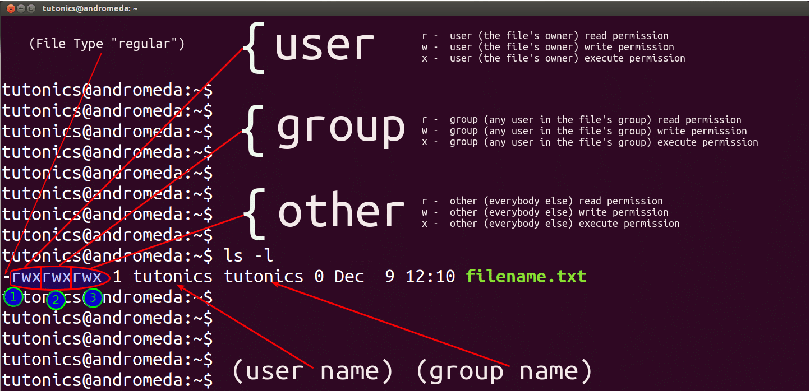

### Contetualizando permissões no linux:


Fazendo um `ld -ls` obtemos:

- `drwxrwxr-x 10 gmapdev  www-data  4096 Mar 29 08:09`

onde: drwxrwxr-x => primeiro caractere representa o tipo que pode ser:

```js
- → Arquivo comum

d → Diretório

l → Link simbólico (symlink)

b → Arquivo de dispositivo de bloco (ex.: discos)

c → Arquivo de dispositivo de caractere (ex.: terminais, dispositivos de som)

s → Socket (comunicação entre processos)

p → FIFO (pipe nomeado)
``

Os demais 3 grupos de caracteres: usuário, grupo e outros.

Imagem abaixo extraida da internet:

