# Instalação do Sass

Requisitos:
>> NodeJS

## Install:
`npm install -g sass`

## Fazer um directory for project:
`mkdir mywebsite`

## inside this folder create  directories:

`css` `scss`

## Watch: (or use install a extention):

`sass --watch scss:css`

## Erro de script no Windows 10:
[thanks for](https://stackoverflow.com/questions/56199111/visual-studio-code-cmd-error-cannot-be-loaded-because-running-scripts-is-disabl)

<figure>
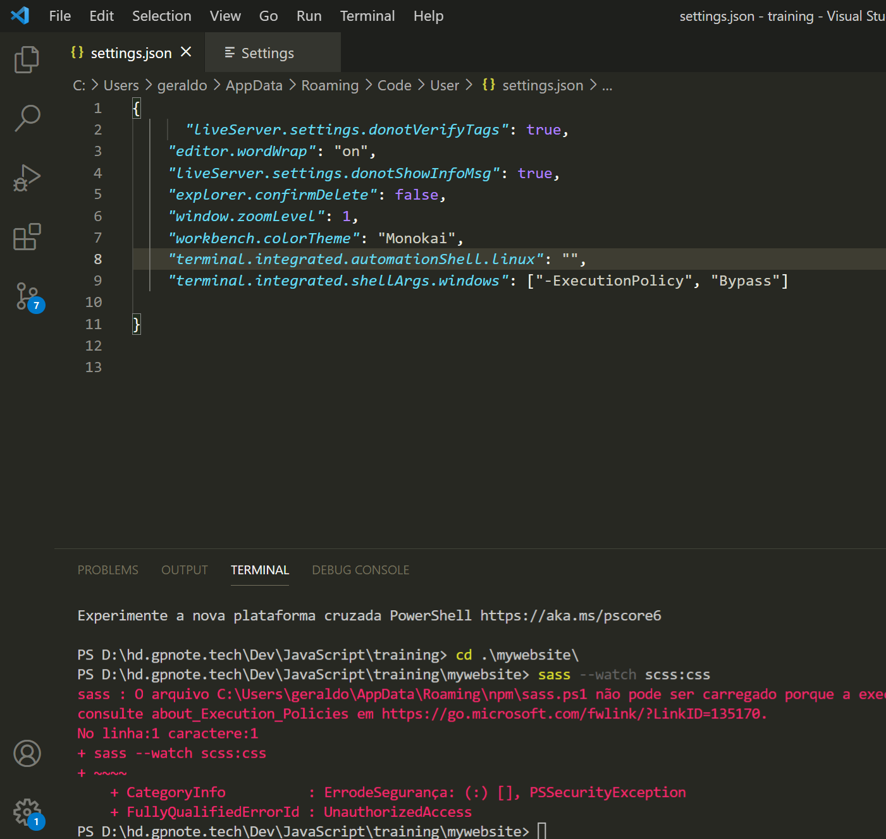
<figcaption>Windows error</figcaption>
</figure>

Ir em File > preferences > Settings  no search write: **automation** 

Adicionar a linha: 

```json
"terminal.integrated.shellArgs.windows": ["-ExecutionPolicy", "Bypass"]
```

## Resolvido
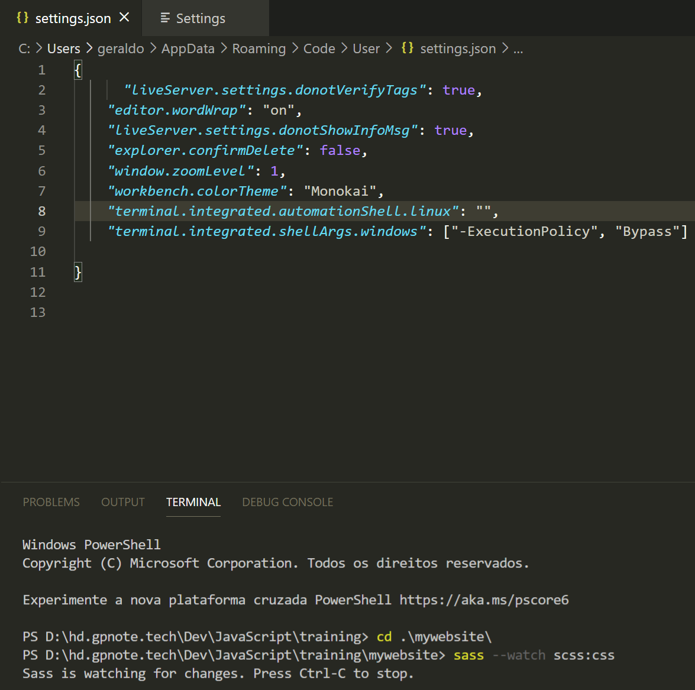


vai em scss e criar style.scss

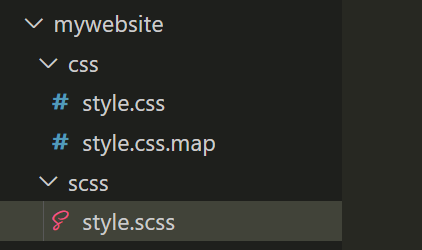

abrir o style.scss e digitar algum style, todo código deve ser escrito no scss: 

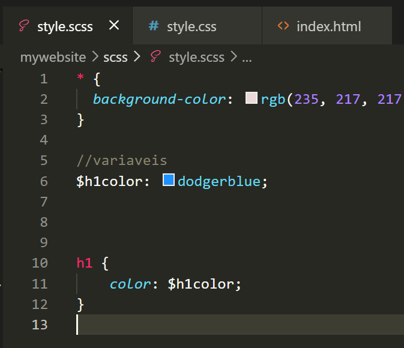

Com o watch o arquivo .css é atualizado em real time.

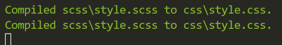

Instalar essa extenção, crie apenas o **style.scss** o **style.css** será gerado automaticamente na mesma pasta.

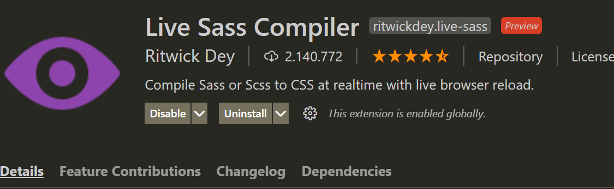

Multiple style variables:

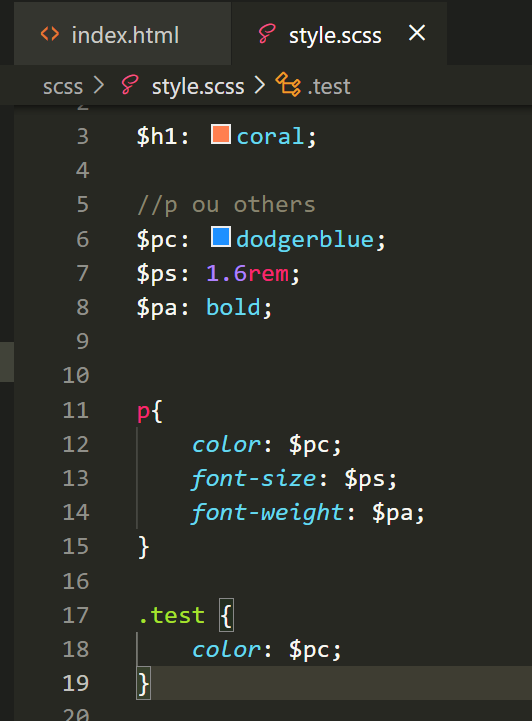

## Nesting in style.scss

before

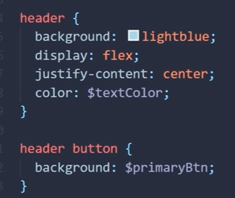

after

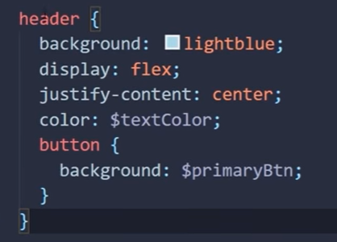

Arquivo grande ou serarar partes do code
10:29 no video https://www.youtube.com/watch?v=Zz6eOVaaelI

Fazer um arquivo chamado `_variables.scss` e declarar o conteúdo. 

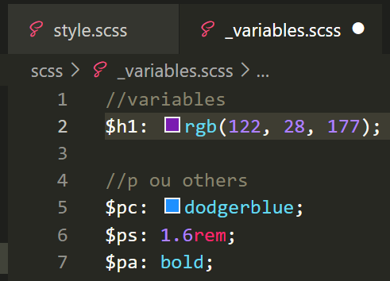

No style.scss `@import "./variables";`

Atenção caso o style.css foi gerado usando o comando, então na próxima vez usar o comando ao invès do liveserver, caso contrário o add irá gerar um novo arquivo sass em outro diretório.

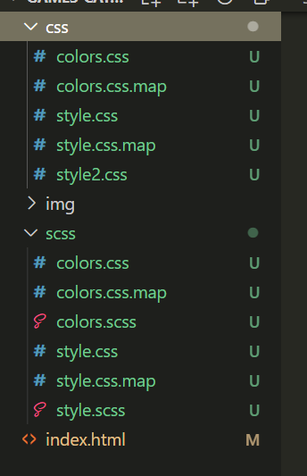

### Refs:

[How to setup a fast node sass/scss project (2021) - YouTube](https://www.youtube.com/watch?v=pGcCWhl6ePQ)

[https://sass-lang.com/guide](https://sass-lang.com/guide)
