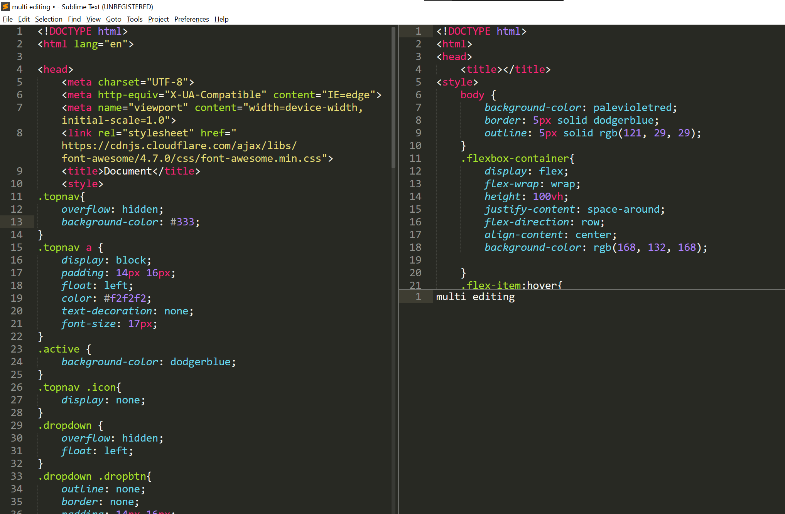
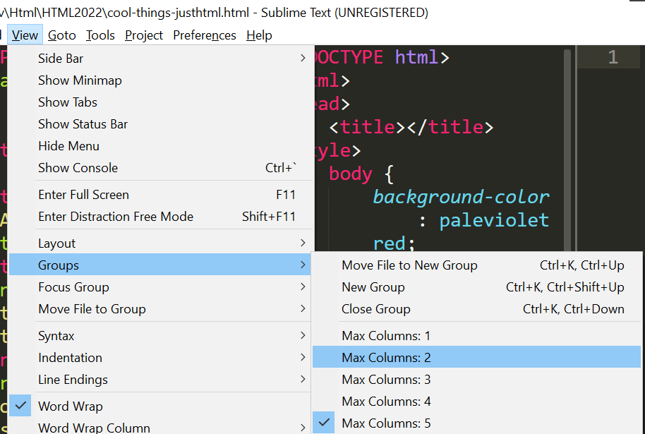
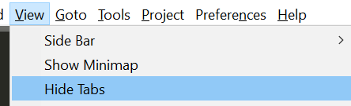

# Sublime

- auto complete basic html
salve as .html type: `<html`

- Clonando linhas: 
`ctrl + shift + d`
 
- Multiple files in a window:

`CTRL + K` em seguida `CTRL + SHIT + UP`
 

  

 Configurar tamanho de grupos 

  

Para fechar tudo: `ALT + Shit + 1` 

Tabs: 

