<div align="center">


</div>


- [https://code.visualstudio.com/shortcuts/keyboard-shortcuts-windows.pdf](https://code.visualstudio.com/shortcuts/keyboard-shortcuts-windows.pdf)


:books:

- [:bookmark: ShortCuts](#shortcuts)
- [:bookmark: ShortCuts CLI](#ShortcutsGitBashCmd)
- [:sparkles: Best Extensions](#best-extensions)
- [:art: Best Themes](#best-themes)
- [:pencil: Fonts](#fonts)
- [:wrench: Settings.json](#settingsjson)

&nbsp;

&nbsp;

&nbsp;

&nbsp;

&nbsp;

&nbsp;

# ShortCuts

- open Settings:
  `CTRL + ,`

- open terminal:
  `CTRL + shit + '`

- open folder:
  `CTRL + K CTRL + O`

- move lines:
  `ALT + UP/Down`

- Clone lines:
  `shift+ alt + arrow up or down`

- open / closed explorer folder:
  `CTRL + B`

- comment multiple lines type 👉 `\* */`:
  `shitf + alt + A` or   `CTRL + /` 

- single comment 👉 `// or <!-- -->`:
  `CTRL + K, + C`

- Emmet: wrap - englobar elementos selecionados `CTRL + shift + p` type `wrap or emmet` and type a `tag`

- multiple cursos: `click + alt`

- delete current lines:
  `CTRL + shit + k`

- search:
  `F1 or CTRL + shift + P` to search files by name delete `>` in input

- Language Mode settings or click on bar:
  `CTRL + K, M`

-  multiple same word:
  `CTRL + D` or `CTRL + F2`

- multiple select
  `holt alt + mouse select`

- sugestions:
  `CTRL + space`

- Lorem ipsum shortcut | também funciona no CodePen:
  `Lo` , `lorem` ou `lo` - cria um texto com 225 caracteres. - Textos menos caracteres ou mais caracteres
  `lorem3` - 3 caracteres
  `lorem200` - 200 caracteres

- Themes:
  `CTRL + K + T`

- Formatter identar code [About](https://medium.com/code-write/atalho-para-identar-c%C3%B3digo-no-vs-code-dicarapida-1b85c9607b1b)
  `Alt + shift + F`

- zen mode:
  `CTLR + K Z`

- close all methods:
  `CTRL + K + CTRL + 0`
- open all methods:
  `CTRL + K + CTRL + J`

- reload 
  `ctrl + shift + p` type: reload 'Developer reload window'

## Selecionar vários:

selecione a parte do código depois aplique:
`CTRL + D`

<div align="center">
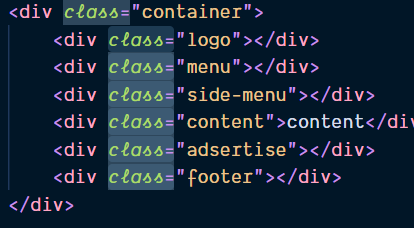
</div>

use as setas para mover o cursor vai selecionar até o próximo obstaculo:
`Shift + alt + seta teclado >`

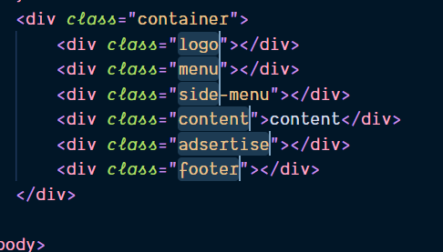

pronto só colar!

Digitar em todas as linhas ao mesmo tempo: `CTRL + Shift + alt + seta key down`

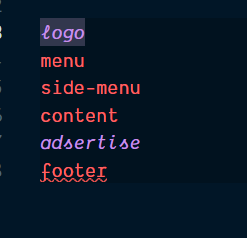

só digitar os parametros

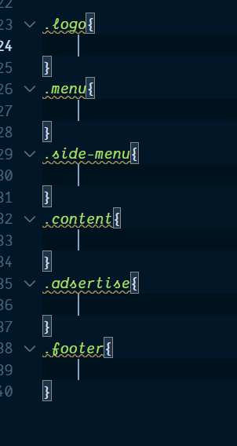

## create mult tags once:

#### também funciona no CodePen teclar TAB

create 6 divs:
`div*6`

create 5 section with class:
`section.lead*5`

create 4 div class vazias:
`div*4.`

create 6 div with className

`div.className*6`

create 5 div com text de 1 a 5:
`div*5{$}`

create 10 div + 10 className and txt in order:
`div*10.myclass{$}`

create this: `div*5.className${$}`

```html
<div class="className1">1</div>
<div class="className2">2</div>
<div class="className3">3</div>
<div class="className4">4</div>
<div class="className5">5</div>
```


# ShortcutsGitBashCmd:

- open current path in VSCode `code .`
- open specific file in VSCode `code README.MD`
- open Folder:
  - `explorer .`
      - `explorer file.html`
  -  `start .`
      - `start file.html` open browser
      - `start a.txt` open Notepad

## Best themes

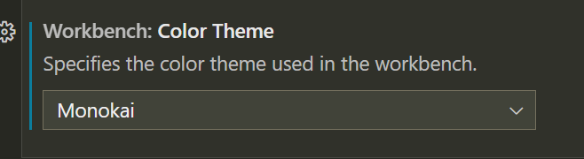
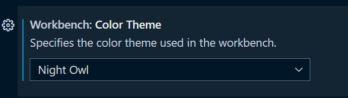
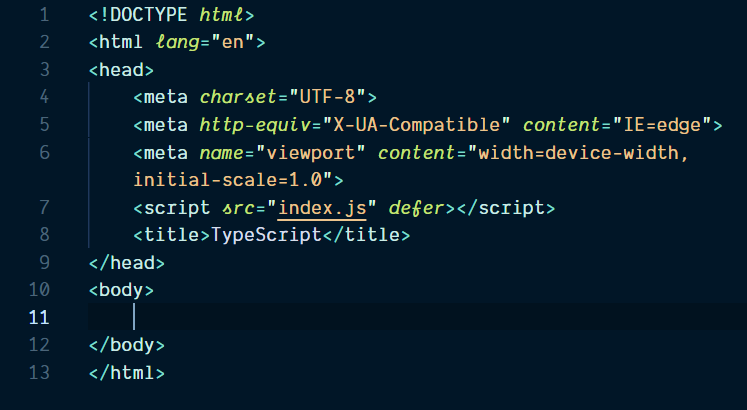
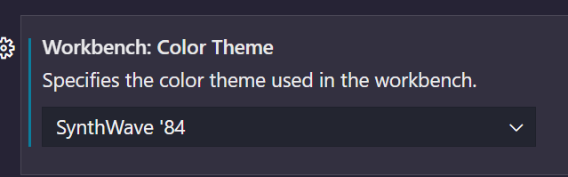
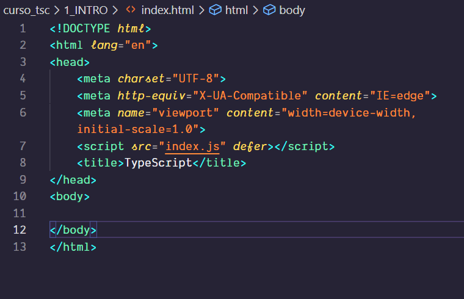
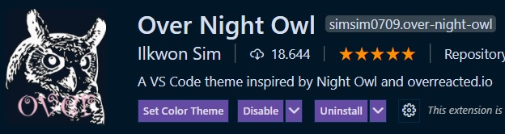
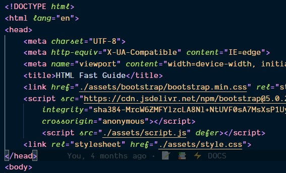 

- [Origamid](https://github.com/origamid/origamid-vscode)
- Andromeda
- [Omni Owl](https://marketplace.visualstudio.com/items?itemName=guilhermerodz.omni-owl) + Dank Mono
- [Night-owl](https://marketplace.visualstudio.com/items?itemName=sdras.night-owl)  + Dank Mono
- [Vesper](https://marketplace.visualstudio.com/items?itemName=Obstinate.vesper-pp)

## Fonts:

### Dank Mono
install a font `Dank Mono` [Link download](https://app.box.com/s/bv70o32xwpxnk36l1dth2cd5z7d9t0z6) e depois configurar o `settings.json`
`add : "editor.fontFamily": "Dank Mono"`

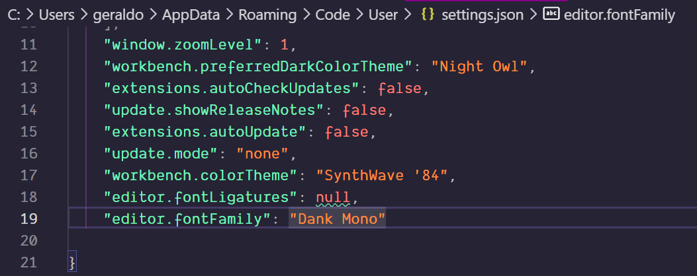

**Sem Dank Mono**  
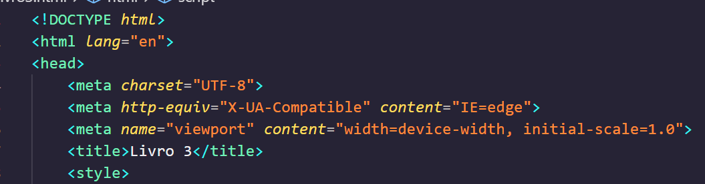

**Com Dank Mono**  
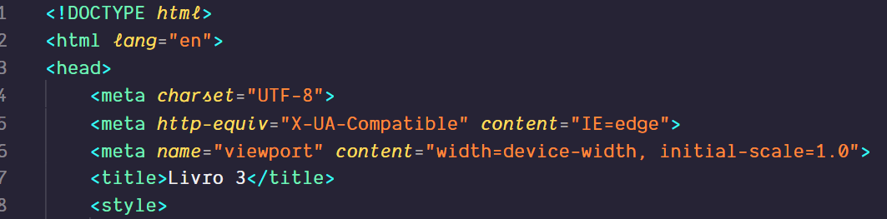

### JetBrains Mono  https://vueschool.io/articles/vuejs-tutorials/how-to-install-jetbrains-mono-font-in-visual-studio-code/


## Best Extensions

- Prettier - Code formatter

  - Abrir o command palette `CTRL + SHIT + P` digite `Open Settings JSON` e definir:
  - para auto save adicionar a linha:
    `"editor.formatOnSave": true,`
  - Set as default Formatter:
    ` "editor.defaultFormatter": "esbenp.prettier-vscode"`
  - Registrar os tipos:
    - JavaScript: `"[javascript]": {      "editor.defaultFormatter": "esbenp.prettier-vscode" },`
    - HTML: `"[html]": {      "editor.defaultFormatter": "esbenp.prettier-vscode" },`
    - 
  - TabWidth: `"prettier.tabWidth": 2`
  - Remove semicolons: `"prettier.semi": false,`
  - Set single quotes: `"prettier.singleQuote": true,`
  - remove trailing commas: `"prettier.trailingComma": "none",`
    

- GitLens
- Quokka
- Vetur
- Live Sass Compiler
- Live Server
- REST Client - Huachao Mao
- live preview - no precisa sem salvar
- codesnap - beautiful prints

### React and NextJS
- [Material Icon Theme](https://marketplace.visualstudio.com/items?itemName=PKief.material-icon-theme)
- [Tailwind CSS IntelliSense](https://marketplace.visualstudio.com/items?itemName=bradlc.vscode-tailwindcss)
- [JavaScript and TypeScript Nightly](https://marketplace.visualstudio.com/items?itemName=ms-vscode.vscode-typescript-next)

### NodeJS Back-end
- [https://marketplace.visualstudio.com/items?itemName=Prisma.prisma](https://marketplace.visualstudio.com/items?itemName=Prisma.prisma)

## settings.json

Arquivo para configurações gerais:

- open User `settings.json`:
  -   `CTRL + P type:settings.json`
  -   `CTRL + , > click Open Settings(JSON) next run code`

- `"editor.mouseWheelZoom": false,` - desativar zoom do mouse:
- `"window.zoomLevel": 1,` - Default zoom
- `"editor.wordWrap": "on" ` - Wrap Text

[REF](https://www.youtube.com/watch?v=TBplwrsUj4s&t=1083s)
