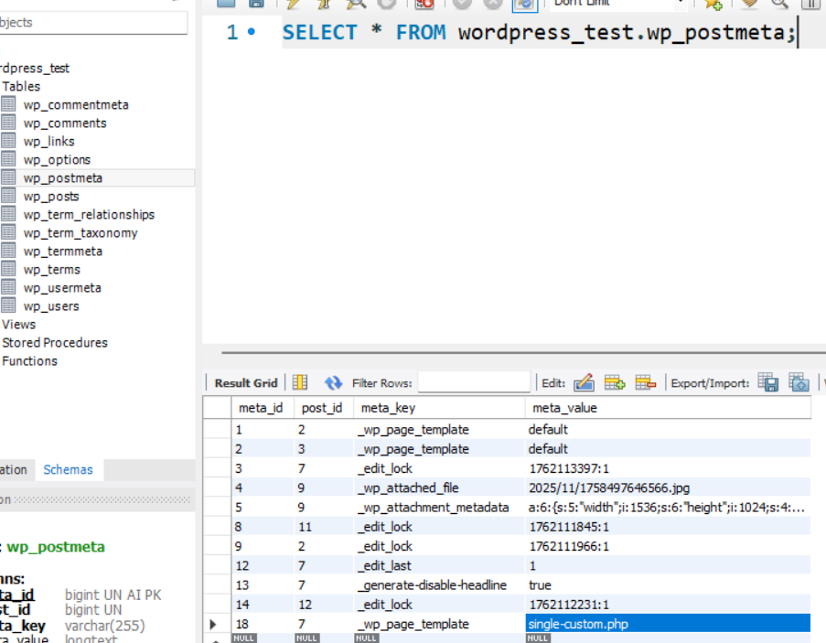

## Start in wordpress 2025

- Setup a Apache, PHP and MySQL server
- Download latest in https://wordpress.org/download/


- `The web server cannot generate responsive image sizes for this image. Convert it to JPEG or PNG before uploading.`
	- no php.ini habilitar `extension=gd` => restart apache server

- `Installation failed: Download failed. No working transports found`
	- no php.init habilitar: curl, openssl


### custom templates

- Instale o tema GeneratePress e ative
    - criar um `single-custom.php` com o conteudo abaixo:

<details>
<summary>abrir</summary>
	
```php
<?php

if ( ! defined( 'ABSPATH' ) ) {
	exit; // Exit if accessed directly.
}
/*
Template Name: Custom Layout
Template Post Type: post
*/
get_header(); ?>

	<div <?php generate_do_attr( 'content' ); ?>>
		<main <?php generate_do_attr( 'main' ); ?>>
			<?php
			/**
			 * generate_before_main_content hook.
			 *
			 * @since 0.1
			 */
			do_action( 'generate_before_main_content' );

			if ( generate_has_default_loop() ) {
                echo '<h1>title</h1>';
				while ( have_posts() ) :

					the_post();

					generate_do_template_part( 'single' );

				endwhile;
			}

			/**
			 * generate_after_main_content hook.
			 *
			 * @since 0.1
			 */
			do_action( 'generate_after_main_content' );
			?>
		</main>
	</div>

	<?php
	/**
	 * generate_after_primary_content_area hook.
	 *
	 * @since 2.0
	 */
	do_action( 'generate_after_primary_content_area' );

	generate_construct_sidebars();

	get_footer();
```

</details>


o wordpress salva as informações de cada post x o tipo de template na table `wp_postmeta`





